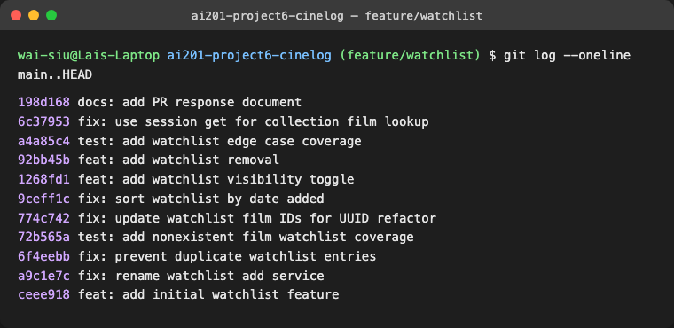

# PR Response Doc — CineLog Watchlist Feature

## AI Usage
I used AI for codebase orientation, especially to summarize `models.py`, `services/collection_service.py`, and `tests/test_collection.py` before reading the review comments. I also used AI as a devil's advocate for Comments 4 and 5 by asking what a careful reviewer might challenge about default-public visibility and newest-first sorting. The useful counterarguments were privacy surprise for public watchlists and discoverability for older saved films, so I addressed both tradeoffs in my final responses. Finally, I used AI to check whether my commit messages followed conventional commit format and whether any commits bundled unrelated logical changes; I then rewrote the history into smaller commits.

## Comment 1 — Rename
**What I did:** I renamed `save_to_watchlist()` to `add_to_watchlist()` in `services/watchlist_service.py` and updated the route call site in `routes/watchlist/watchlist.py`.

**How I verified:** I used a project-wide search for `save_to_watchlist` to confirm there were no remaining references. The only call site was the watchlist add route, and it now imports and calls `add_to_watchlist()`. I also ran the test suite with `python -m pytest tests/ -v`.

## Comment 2 — Deduplication
**What I did:** I added `AlreadyInWatchlistError`, checked for an existing `WatchlistEntry` with the same `user_id` and `film_id` before inserting, mapped the duplicate case to `409 Conflict` in the route, and added the `unique_user_film_watchlist` database constraint.

**How I verified:** I modeled the logic after `add_to_collection()` in `services/collection_service.py`: validate the film exists, query for an existing user/film entry, raise a domain-specific error if found, and only then create the row. I verified the behavior with `test_add_to_watchlist_duplicate_raises`, which confirms a duplicate raises `AlreadyInWatchlistError` and only one row remains.

## Comment 3 — Missing Test
**What I did:** I created `tests/test_watchlist.py` and added `test_add_to_watchlist_nonexistent_film_raises`, modeled after `test_add_to_collection_nonexistent_film_raises` in `tests/test_collection.py`.

**How I verified:** The test creates an isolated in-memory app and sample user, calls `add_to_watchlist()` with a fake UUID, and asserts that `FilmNotFoundError` is raised. I ran `python -m pytest tests/test_watchlist.py -v` and the full suite with `python -m pytest tests/ -v`.

## Comment 4 — Default Visibility
**My position:** I kept `public=True` as the default, but added an explicit `public` parameter so callers can create private watchlist entries when needed.

**Reasoning:** CineLog is framed as a community film tracking app, so a public default supports the social value of the platform: people can discover what others plan to watch, compare taste, and start conversations around future viewing. For that product context, public-by-default makes the watchlist more useful as a community signal instead of only a private reminder list.

**Tradeoff acknowledged:** Private-by-default would optimize for user privacy and reduce the chance that someone accidentally shares a film they meant to keep private. I think keeping `public=True` is acceptable here because it preserves the original behavior and fits CineLog's community focus, but the new `public` parameter gives clients a clear way to offer privacy controls in the UI. If CineLog later decides watchlists are more personal than social, changing the default should be a separate product decision with migration notes.

## Comment 5 — Sort Order
**My position:** I changed the default watchlist order from alphabetical title order to newest-first by `WatchlistEntry.date_added.desc()`.

**Reasoning:** A watchlist is a user activity list, not a full catalog. The most common user behavior is likely checking what they recently saved and deciding what to watch next. Newest-first also matches the existing `get_collection()` pattern for user-specific film lists, making collection and watchlist behavior consistent.

**Engagement with reviewer's point:** I agree with the maintainer's point that most users want to see what they added recently. Alphabetical order is useful for browsing the global film catalog or a very large saved list, but it hides recent intent. If the watchlist grows enough that alphabetical browsing matters, a future endpoint could add an explicit `sort=title` option without changing the default behavior.

## Comment 6 — Rebase
**What conflicted:** The updated `main` branch migrated film IDs from integers to UUID strings. The watchlist branch still had `WatchlistEntry.film_id` and route/service documentation written around integer film IDs.

**How I resolved it:** I rebased `feature/watchlist` onto `origin/main`, kept the UUID-based `Film.id`, and updated `WatchlistEntry.film_id` to `db.String(36)` with a foreign key to `film.id`. I also updated the watchlist service and route documentation to refer to UUID film IDs.

**How I verified no conflict remains:** I confirmed `origin/main` is an ancestor of `HEAD`, checked that `git log origin/main..HEAD --merges --oneline` returns no merge commits, searched for integer watchlist film ID references, and ran `python -m pytest tests/ -v`.

## PR Description
This PR adds a watchlist feature to CineLog so users can save films they want to watch later. It adds a `WatchlistEntry` model, service functions for adding, listing, and removing watchlist entries, and REST endpoints under `/watchlist`.

Design decisions: watchlist entries remain `public=True` by default because CineLog is a community film tracking app and public watchlists support discovery and social sharing. The add endpoint also accepts `public: false` so clients can create private entries explicitly. Watchlists are sorted newest-first because users usually want to see what they recently saved when deciding what to watch next.

Manual testing steps:
1. Create and activate the environment: `python -m venv .venv && source .venv/bin/activate`.
2. Install dependencies: `python -m pip install -r requirements.txt`.
3. Run automated tests: `python -m pytest tests/ -v`.
4. Start the app: `python app.py`.
5. Use existing test data or create rows in a Flask shell, then call `GET /watchlist/<user_id>` to list a user's watchlist.
6. Add a public entry with `curl -X POST http://127.0.0.1:5000/watchlist/<user_id>/add -H 'Content-Type: application/json' -d '{"film_id":"<film_id>"}'`.
7. Add a private entry with `curl -X POST http://127.0.0.1:5000/watchlist/<user_id>/add -H 'Content-Type: application/json' -d '{"film_id":"<film_id>","public":false}'`.
8. Confirm adding the same film twice returns `409 Conflict`.
9. Remove an entry with `curl -X DELETE http://127.0.0.1:5000/watchlist/<user_id>/remove -H 'Content-Type: application/json' -d '{"film_id":"<film_id>"}'`.

## Git Log Screenshot
The final `git log --oneline main..HEAD` output shows conventional commits and no merge commits:

## Stretch: Remove from watchlist
I added `remove_from_watchlist(user_id, film_id)` and `DELETE /watchlist/<user_id>/remove`. The function follows the `remove_from_collection()` pattern: query for the user/film entry, raise `NotInWatchlistError` if it does not exist, delete it if it does, commit, and return `True`. I wrote tests for both successful removal and the missing-entry error case.

## Stretch: Additional Edge Case Test
I added `test_add_to_watchlist_accepts_private_visibility`. I chose this case because visibility is user-facing and easy to regress if future code assumes every watchlist entry uses the default public value.

## Stretch: Visibility Toggle Endpoint
I added a `public` parameter to `add_to_watchlist()` and the POST `/watchlist/<user_id>/add` endpoint. The default remains `public=True`, so existing callers do not need to change anything. A caller can create a private entry by sending `{"film_id":"<film_id>","public":false}` in the JSON body.
